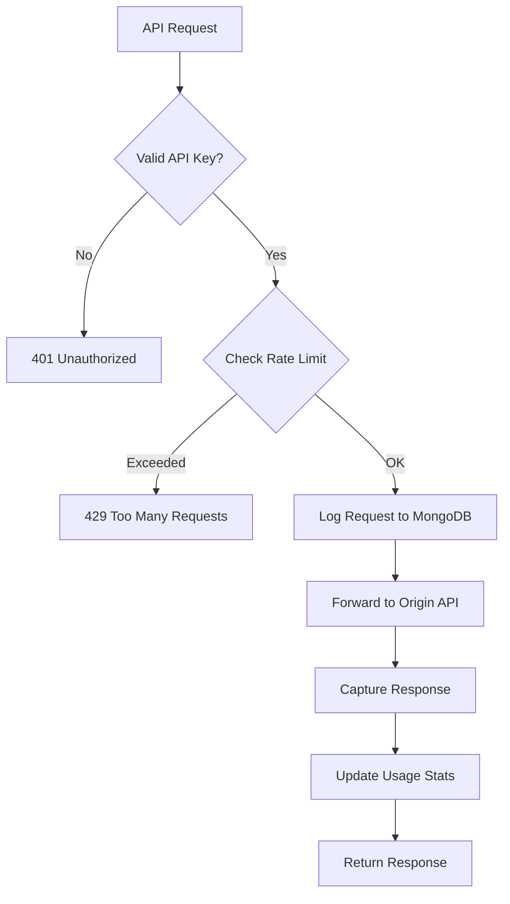
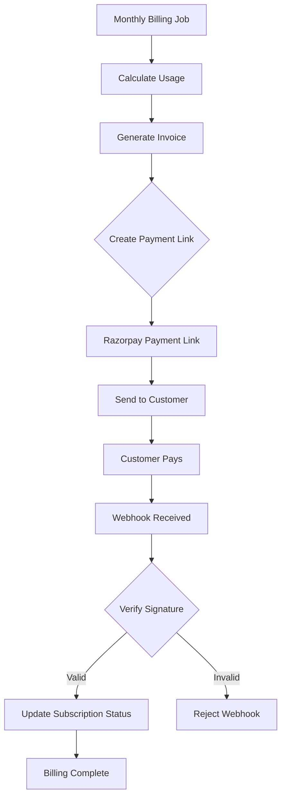
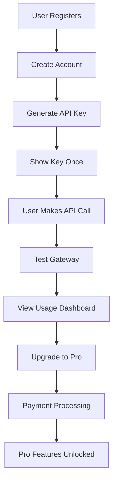

# MeterFlow

Usage-based API billing and metering platform MVP based on the PRD in `C:\Users\Dell\Downloads\MeterFlow_PRD.docx`.

## Introduction

MeterFlow is a comprehensive usage-based API billing and metering platform designed to help API providers monetize their services effectively. It provides a complete solution for API key management, real-time usage tracking, rate limiting, billing automation, and payment processing through Razorpay integration. The platform includes both a backend API gateway and a modern React dashboard for seamless user experience.

## Use Cases

- **API Monetization**: Enable API providers to charge customers based on actual usage rather than fixed subscriptions
- **Usage Analytics**: Track and analyze API consumption patterns for business intelligence
- **Automated Billing**: Generate invoices and process payments automatically based on usage metrics
- **Developer Onboarding**: Provide self-service API key generation and management for developers
- **Rate Limiting**: Protect APIs from abuse while ensuring fair usage across customers
- **Multi-tenant Management**: Support multiple API providers and their customers in a single platform

## Industry Value

MeterFlow addresses the growing need for flexible API monetization strategies in the API economy. Traditional fixed-price API subscriptions often lead to underutilization or overcharging. Usage-based billing allows for:

- **Fair Pricing**: Customers pay only for what they use, reducing barriers to adoption
- **Scalable Revenue**: Revenue grows with usage, creating predictable scaling opportunities
- **Data-Driven Insights**: Detailed usage analytics help optimize API design and pricing
- **Competitive Advantage**: Modern billing models attract more customers compared to legacy pricing
- **Cost Efficiency**: Automated billing reduces operational overhead for API providers

## Roles

### For API Providers
- Create and manage API endpoints
- Set pricing plans and billing cycles
- Monitor usage analytics and revenue
- Manage customer accounts and support

### For API Consumers (Developers)
- Register and manage API keys
- Monitor usage and billing status
- Access real-time usage dashboards
- Upgrade/downgrade subscription plans

### For System Administrators
- Deploy and maintain the platform
- Configure payment gateways and webhooks
- Monitor system health and performance
- Manage database and infrastructure

## Tech Stack and Rationale

### Backend (Node.js/Express)
- **Node.js**: Chosen for its asynchronous I/O capabilities, making it ideal for handling high-concurrency API requests
- **Express.js**: Lightweight web framework for building RESTful APIs with middleware support
- **PostgreSQL**: Relational database for structured data like users, APIs, and billing records
- **MongoDB**: NoSQL database for flexible storage of usage logs and analytics data
- **Redis**: In-memory data store for caching API keys and implementing rate limiting
- **BullMQ**: Queue system for background job processing like billing calculations
- **Socket.io**: Real-time communication for live usage updates in the dashboard

### Frontend (React/Vite)
- **React**: Component-based UI library for building interactive dashboards
- **Vite**: Fast build tool and development server for modern web applications
- **Lucide React**: Icon library for consistent UI elements

### Infrastructure
- **Docker**: Containerization for consistent deployment across environments
- **Docker Compose**: Orchestration for multi-service applications
- **Nginx**: Reverse proxy and load balancer for production deployments

### Payment Integration
- **Razorpay**: Indian payment gateway for secure payment processing and webhooks

## Explanation of Technologies

### API Gateway Architecture
The core of MeterFlow is its API gateway that sits between API consumers and providers. It validates API keys, enforces rate limits, logs usage, and forwards requests to the actual API endpoints.

### Key Management
- API keys are generated with `mf_test_` and `mf_live_` prefixes for different environments
- Keys are hashed with SHA-256 for secure storage
- Raw keys are shown only once during creation
- One-click rotation with 24-hour grace period for existing keys

### Rate Limiting
- Sliding-window algorithm implemented with Redis
- Prevents API abuse while allowing burst traffic
- Configurable limits per API and customer

### Usage Tracking
- Immutable request logs stored in MongoDB
- Real-time updates via Socket.io
- TTL indexes for automatic data cleanup

### Billing System
- Monthly billing cycles with BullMQ job queues
- Idempotent processing to prevent duplicate charges
- Integration with Razorpay for payment links and webhooks

### Real-time Dashboard
- React-based interface for usage monitoring
- Live updates for API calls and billing status
- Self-service key management and billing portal

## Screenshots of Functionalities

### Dashboard Overview
Main dashboard showing usage metrics (0 requests this month, 0ms average latency, 0 errors, ₹0.00 current bill), API creation form with name and origin URL fields, and navigation sidebar with Usage, API keys, and Billing tabs after login.

### API Key Management
API keys interface showing generated test key "mf_test_uNOnHZyDpOP4epFA57cMh3xiX7X1Bt5s" with "Default test key" label, test environment indicator, active status, PokeAPI demo association, and "Rotate key" button. Includes cURL command for testing and "Copy cURL" button.

### Usage Analytics
Usage dashboard displaying 1 request this month (1% of free tier), 188ms average latency ("Gateway overhead visible"), 0 errors, ₹0.00 current bill (₹10,000.00 hard cap). Shows request ledger with GET /pokemon/ditto entry (200 status, 188ms response time).

### Billing Portal
Subscription management showing "Current Plan: Free" with upgrade prompt, "Upgrade to Pro" button. Usage summary: 1 request included in free tier (1,000), ₹0.10 overage rate per 100 requests, ₹0.00 current bill.

### API Gateway Logs
Request ledger section showing real-time API call logs with method (GET), endpoint (/pokemon/ditto), status code (200), and response time (188ms). Includes "Calculate bill" button for billing operations.

## Flowcharts

### API Request Flow


### Billing Flow


### User Onboarding Flow


## What is built

- Express gateway at `/gateway/:apiId/*`
- Managed API keys with `mf_test_...` / `mf_live_...` format
- SHA-256 key storage only, raw key shown once
- Key revoke and one-click rotation with a 24-hour grace period
- Redis key cache and sliding-window rate limiting
- MongoDB immutable request ledger with required compound and TTL indexes
- Postgres auth, plans, keys, APIs, and billing periods
- BullMQ billing queue with idempotent monthly billing jobs
- Socket.io live usage events for the dashboard
- React dashboard for onboarding, first cURL call, usage, keys, and billing

## Run locally

```powershell
Copy-Item .env.example .env
docker compose up -d
npm install
npm run dev
```

Open `http://localhost:5173`.

## Run without Docker

If Docker Desktop is not available, use the in-memory demo runtime. It exposes the same product API and gateway flow, but data resets when the process stops.

```powershell
npm run demo
```

Open `http://localhost:5173`.

## Deploy

For a single-host deployment with the dashboard served by the API container:

```powershell
$env:JWT_SECRET = "replace-with-a-long-random-production-secret"
docker compose -f docker-compose.prod.yml up --build -d
```

Then open `http://localhost:4000`.

For managed infrastructure, use the root `Dockerfile` and set `DATABASE_URL`, `MONGO_URL`, `REDIS_URL`, `JWT_SECRET`, `APP_ORIGIN`, and `SERVE_WEB=true`.

## GitHub Actions CI

A CI workflow is included at `.github/workflows/ci.yml`. It runs on push and pull request, installs dependencies, builds both workspaces, and validates the Docker image build. To enable Docker publishing, set `DOCKER_USERNAME`, `DOCKER_PASSWORD`, and `IMAGE_NAME` in GitHub repository secrets.

The repository also includes convenience scripts:

- `npm run docker:build`
- `npm run docker:prod`
- `npm run docker:down`

## Conclusion

MeterFlow represents a complete solution for API monetization in the modern API economy. By combining robust backend infrastructure with an intuitive user interface, it enables API providers to focus on building great APIs while the platform handles the complexities of billing, usage tracking, and customer management.

The modular architecture allows for easy scaling and customization, making it suitable for startups launching their first API products as well as established companies looking to modernize their monetization strategies.

Key achievements of this MVP include:
- Full-stack implementation with production-ready features
- Secure payment processing and webhook handling
- Real-time analytics and monitoring
- Automated billing and subscription management
- Comprehensive documentation and deployment guides

Future enhancements could include additional payment gateways, advanced analytics, multi-tenant isolation, and integration with popular API management platforms.
